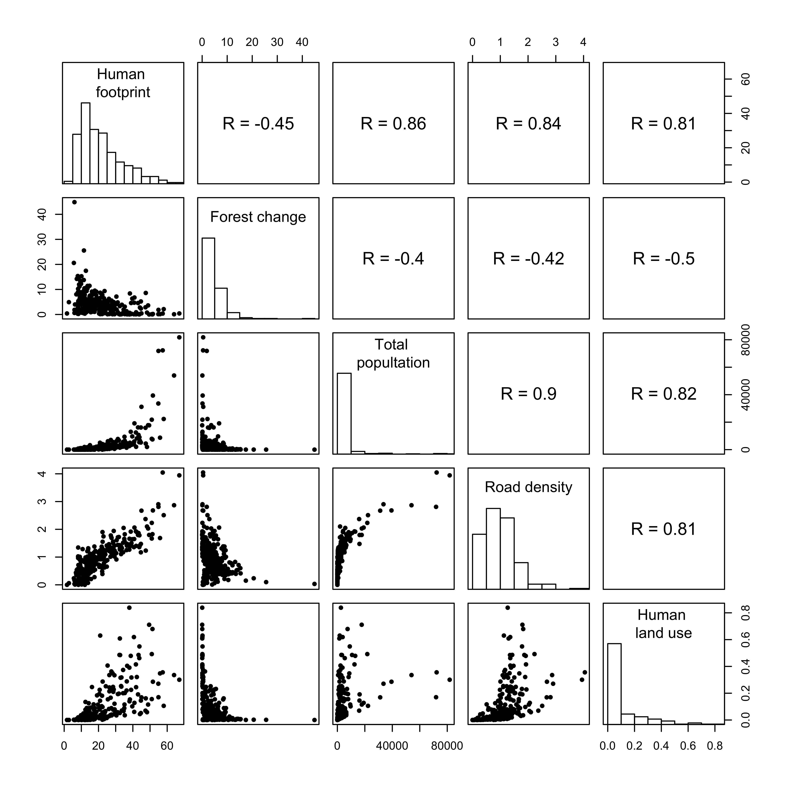

Does human land-use lead to biotic homogenisation of forest bird communities in northern USA?
================
Eric Le Tortorec, Matti Häkkilä, Edmund Zlonis, Gerald Niemi, Mikko Mönkkönen
10-08-2018

Introduction
============

Global studies have shown that human-caused land-use changes and their associated pressures have led to strong, consistent and accumulating negative impacts on biodiversity (Haddad et al. 2015). Human pressures that contribute to land use change such as agriculture, timber harvesting, and urbanisation have significantly modified ecosystems worldwide (Foley et al. 2005). Of these, forest ecosystems have been especially heavily impacted by human activities, showing a decrease in area of over 3% during just the last 25 years (FAO 2016). There are signs that the rate of forest loss is decreasing but the proportion of managed forests is increasing at the expense of natural forest cover (FAO 2016). In addition, an increasing threat to forests worldwide is harvesting forests for bioenergy (Sheppard et al. 2011). Natural forests harbour high levels of productivity, biomass, and biodiversity (Foley et al. 2005) and decreases in their cover have the potential to have significant negative impacts on biodiversity and ecosystem services.

Human activities appear to impact different scales of biodiversity in different ways (McGill et al. 2015). Studies have shown that biodiversity at the local scale (alpha diversity) has not changed significantly through time, whereas biodiversity at the global scale has decreased. For example, Vellend et al. (2013) showed that local-scale plant species diversity has not significantly changed through time, and that species increases are as common as species decreases. Similarly, Dornelas et al. (2014) showed that time series of local species richness did not show a systematic loss, although community composition did change. However, Newbold et al. (2015) inferred from models based on empirical data that at a global scale, local assemblages have lost over 13% of their species richness due to human pressures. The discrepancy between trends in local and global biodiversity can be explained by a spatial measure of biodiversity --- beta diversity.

Beta diversity measures variation in biodiversity in space and, since it cannot be measured directly, is derived from the total diversity of a region (gamma diversity) and the local diversities of sampled sites. Beta diversity, in its additive form, is calculated as gamma diversity minus the mean alpha diversity of a region (Tuomisto 2010). In this form, beta diversity reflects absolute effective species turnover by quantifying how much the effective species richness of an entire region exceeds that of an average single location. A higher level of beta diversity in a region indicates that the composition of local sites is different from each other than in a region with a lower level of beta diversity. Thus, even though local diversity might not show a decrease, the total diversity of a region could decrease if the individual sites became more similar in composition. For example, uneven losses in species between sites can lead to decreased mean alpha diversity, which will increase the beta diversity of a region. On the other hand, the colonisation of specialists into new sites can increase mean alpha diversity (McCune and Vellend 2013), leading to a decrease in the beta diversity of a region. This holds for both the additive and multiplicative forms of beta diversity. Thus, in a conservation setting, maximising beta diversity could lead to negative impacts on local biodiversity (Socolar et al. 2016).

Increasing similarity between local sites (decreased beta diversity), is a process known as biotic homogenisation (Olden 2006). Biotic homogenisation has been shown to be a global phenomenon, occurring in almost all taxonomic groups (Baiser et al. 2012) and resulting from human land-use intensification, including urbanisation (McKinney 2006) and intensive agriculture (Ekroos et al. 2010). Human activities causing the introduction of exotic and invasive species and extinctions of native species have the potential to cause species composition in different sites to become more similar (Baiser et al. 2012). Local species extinctions often involve specialists with narrow dietary and habitat preferences, and they are often replaced by generalists that can withstand fluctuating environmental conditions and human-built environments (McKinney and Lockwood 1999, Clavel et al. 2011). These generalists have often been described as species with global ranges but there is evidence that they are often native species (La Sorte and Boecklen 2005). Since specialists, by definition, possess specialised functions, their loss in a community decreases functional diversity. Functional diversity is of special concern for human well-being as it is an important component of ecosystem functioning, which is the basis of the ecosystem services that humans depend on (Cardinale et al. 2012). There is already evidence that the loss of biodiversity is creating an ecosystem services debt that will be exacerbated by continuing biodiversity loss (Isbell et al. 2015), with potential decrease in the resilience of ecosystem functions (Oliver et al. 2015). In addition, specialised species often have unique phylogenetic histories, the loss of which decreases the phylogenetic diversity of communities. Since biotic homogenisation, and many other phenomena related to biodiversity, has been studied mainly from the aspect of the number of species (taxonomic diversity) we still have a limited understanding of how different facets of biodiversity respond to human activities.

We studied how land-use change due to human actions causes biotic homogenisation in bird communities of forested habitats in the state of Minnesota, USA. Our aim was to study if an increasing human footprint, which includes human population density, land transformation, transport infrastructure, and electrical power infrastructure, causes bird communities to become more similar to each other (decreased beta diversity) as predicted by biotic homogenisation theory. We also addressed if biotic homogenization is associated with changes in regional forest cover, which would be expected based on the overall negative effects that habitat loss has on biodiversity We controlled for factors known to impact biodiversity, including habitat diversity, net primary productivity, and temperature (Qian 2010). We studied this phenomenon from the taxonomic, functional and phylogenetic viewpoints. We predicted that increased human footprint and forest change would lead to decreased diversity between bird count sites, visible as decreased beta diversity. We also expected taxonomic, functional, and phylogenetic diversity to show different sensitivities to human influence (Devictor et al. 2010).

Methods
=======

Study design
------------

Bird point count data were collected between 2009 and 2014 as part of the Minnesota Breeding Bird Atlas ([MNBBA](https://mnbirdatlas.org/); Pfannmuller et al. (2017)). The goal of the MNBBA was to systematically sample breeding birds across the state by collecting data in each township of the state. Townships measure approximately 93 km2 (6 x 6 miles) and were developed by the Public Land Survey System ([PLSS](https://nationalmap.gov/small_scale/a_plss.html)). Within each township, three point locations were selected. The first point was placed in a random land use class, the second point represented the most common land use class in the township, and the last point was placed in the second most common land use class in the township. Land use data were derived from the 2001 National Land Cover Database (Homer et al. 2004). Counts were conducted primarily on secondary roads; large, paved roads such as state or federal highways were avoided. Townships in roadless areas such as the Boundary Waters Canoe Area Wilderness, Voyageurs National Park, and the Red Lake Peatland were sampled from trails, portages, and water by hiking, biking, boat, or canoe. For the purposes of this study, the townships in Minnesota were combined into 617 units, each comprising four townships and measuring roughly 19.3 x 19.3 km (12 x 12 miles). Each unit formed a square, except for a few specific areas where irregular units constructed from one to four townships were used. Units were developed by selecting a random township, which was used as the north-eastern square of the first unit. Subsequent units were then formed using the first unit as a reference point until the entire state was covered.

The primary objective of the MNBBA point counts was to insure equal and consistent sampling of the bird community across the state of Minnesota. This included a random sampling approach and standardization of effort in gathering data within each township. Individuals participating in the gathering of point counts were required to pass a test of 86 bird species songs or have more than 5 years of field experience in counting birds with point counts in Minnesota. Those gathering data on point counts were also tested by audiologists to insure their hearing ability was in normal ranges and they participated in three days of “standardisation” in point count data gathering with an experienced field ornithologist.

During a 10-minute point count, all birds seen or heard were recorded (i.e., unlimited distance) but distances from the point were estimated to allow habitat-specific data to be used (observations within 25, 50, 100 m, and &gt; 100 m of the census point). Point counts were completed from the last week of May (in southern MN) to the second week of July (northern MN) from 2009 to 2014. Most counts were completed in June. Point counts were gathered from approximately 0.5 hour before to four hours after sunrise on days with little wind (&lt; 15 km/hr) and little or no precipitation. Extensions from sunrise to 6 hours were allowed for counts in western MN due to the high proportion of windy days and based on the experience of ornithologists in that region. All points were located and marked with a GPS device, cover type of vegetation visually estimated, and pictures taken in the two directions perpendicular to the road.

A total of 7070 MNBBA counts were performed between May 2009 and June 2014. Abundances of birds identified to the species level within 100m of the MNBBA point were used since the habitat classification was conducted at the same spatial scale (see below). For the analyses in this study we used MNBBA points located in forested land cover classes. To ensure that the dominant habitat being sampled was forest, we first calculated the proportion of landcover types within 100m of each MNBBA count location using the ‘isectpolyrst’ tool in Geospatial Modelling Environment version 0.7.3.0 (Beyer 2012). Landcover classes were derived from the LANDFIRE dataset (Rollins et al. 2006). One hundred and fifteen cover types in the LANDFIRE Existing Vegetation Type database were consolidated and reclassified into 25 classes representing the land-use and habitat available in Minnesota. Each count location was characterized by the dominant (highest proportion) landcover type. All counts with any of the following dominant landcover classes were considered forested; lowland deciduous forest, northern hardwoods, pine forest, boreal deciduous, oak forest, parkland deciduous forest, boreal coniferous, lowland coniferous, rural and urban developed forest, pine-oak barrens and oak savannah. For those MNBBA points that had been counted more than once we selected the earlier observation. We used MNBBA points located at least 200m from each other (twice the distance of the bird count radius) to avoid overlap between bird counts. From pairs of MNBBA points located under 200m from each other we selected the earlier observation, and if both points had the same date one was chosen randomly. For calculating bird community diversities, we only used units that had at least 3 MNBBA points located in a forested land use class (2217 forested MNBBA points in 287 units). We determined 3 points to be the minimum number of communities to reliably estimate beta diversity.

Calculation of beta diversities
-------------------------------

Within each unit we calculated taxonomic, functional, and phylogenetic beta (*β*) diversities with Rao’s quadratic entropy using R functions developed by de Bello et al. (2010) The Rao index measures dissimilarity by summing total dissimilarity and weighting it by species proportions. In addition, the Rao index makes it easy to incorporate alternative measures of biodiversity by taking into account distances (e.g. functional or phylogenetic) between pairs of species (de Bello et al. 2010).

We calculated *β*eqv as the total diversity of a unit (*γ*eqv) minus the average diversity of MNBBA points (*α*eqv) within a unit. We then calculated *β*prop as the proportion of *γ*eqv explained by *β*eqv. By taking the number of forested bird count points into account, we were able to compare the proportion of *γ*eqv explained by *β*eqv between units with differing numbers of points. In addition, using a proportional measure of *β*eqv enabled us to directly compare the proportion explained by different facets of biodiversity (taxonomic, functional, and phylogenetic).

Taxonomic diversity measures were calculated using species abundance data collected from MNBBA bird count locations. We calculated functional diversity by using numerical data on the diet composition, foraging stratum, activity time and body size from the dataset produced by Belmaker and Jetz (2015). Bird species were limited to those species found in our data, and functional distances were calculated with the daisy function in the R package cluster using Euclidean distances. Functional distances were scaled between 0 and 1 and used as a distance matrix in the calculation of diversity metrics. For the calculation of phylogenetic diversity, we downloaded a set of 1000 randomly chosen phylogenetic trees from the BirdTree database (Jetz et al. 2012), limited to the bird species found in our data. We used the consense function from the PHYLIP package (v.3.695) to create a single unrooted consensus tree using the 50% majority rule. This included all species that appeared in more than 50% of the trees. A phylogenetic distance matrix for all species in our data was calculated with the distTips function from the adephylo R package, using the sums of branch lengths. These distances were then scaled between 0 and 1 and used to calculate phylogenetic diversities.

Calculation of explanatory variables
------------------------------------

Human influence was estimated using the human footprint index (HFI) developed by the Wildlife Conservation Society and the Center for International Earth Science Information Network (2005). The HFI uses nine datasets describing four proxies of human influence measured between 1995 and 2004: population density, land transformation, accessibility, and electrical power infrastructure (Sanderson et al. 2002). Each 1km2 grid cell in the global dataset was given a value ranging from 0 (low level) to 10 (high level) for each dataset. The nine values for each grid cell were summed and for each biome, the cell with the lowest value got a value of 0, and the cell with the largest value got a value of 100. The HFI data was clipped to the state of Minnesota, and the average HFI value for each unit was calculated. HFI values in our study area summarised human influence well, as seen in the correlation coefficients between HFI and total population, road density, and cover of human land-use classes (Appendix 1).

In addition to studying the impact of general human influence we also wanted to study how changes in forest cover influence biodiversity. In the state of Minnesota, areas experiencing forest change and those with high human influence are clearly separate (Appendix 1, Appendix 2 a & b). We quantified forest change from the global forest change dataset developed by Hansen et al. (2013). The dataset uses Landsat data to identify stand-replacing disturbances or the total removal of tree canopy cover within each pixel. Using these data, we were able to quantify gross forest loss and gain at an annual frequency between 2000 and 2014. For each unit, we calculated the percent cover of forest change between 2000 and 2014. However, there was no reliable way of systematically separating forest change caused by humans from change caused by natural events such as forest fires and storms. There were four units that had been significantly impacted by three large forest fires (Cavity Lake (2006), Ham Lake (2007), and Pagami Creek (2011) fires). Since the results from models run with and without the affected units did not change significantly, we decided to keep these units in the analyses.

In addition to variables describing human-caused changes in the environment, we also took into account abiotic variables known to impact biological diversity (Qian 2010). Habitat diversity for each unit was quantified by calculating the mean alpha diversity of habitat classes within units. Habitat classes were derived from the LANDFIRE reclassification described above. Temperature and precipitation are both know to impact biodiversity but due to high variance inflation (Zuur 2007) in the models where both variables were included we decided to include only temperature. For each unit, we calculated the mean temperature measured between 1980 and 2010 from data created by the PRISM Climate Group (PRISM Climate Group, Oregon State University in press). Information about net primary production (NPP) was obtained from remotely sensed data collected by the MODIS instrument at a 1km resolution. The algorithm that produces NPP values takes into account vegetation characteristics, meteorological measurements and land cover class and estimates NPP as kg of carbon sequestered in the form of biomass per square metre per year (Zhao et al. 2005). For each unit, we averaged NPP values between 2004 and 2014.

Statistical models
------------------

We constructed linear models to analyse the influence of human footprint, forest change, habitat diversity, temperature, NPP, and the number of forested MNBBA count locations on taxonomic, functional, and phylogenetic beta diversity. In addition, to aid in interpreting the results, we also analysed the influence of the explanatory variables on alpha and gamma diversity of the three facets of biodiversity. The results for alpha and gamma diversities can be found in appendix 3. We checked all models to ensure that the variance inflation factors (VIF) of the explanatory variables were under 3 (Zuur 2007). Correlations between explanatory variables can be found in Appendix 4 and VIF values for all models can be found in Appendix 5.

We visually inspected the residuals of all models to ensure that they were normally distributed, and tested residuals for spatial autocorrelation. Spatial autocorrelation of residuals was tested with a permutation test for the Moran's I statistic using 1000 permutations. All of the residuals from models explaining taxonomic diversity and models explaining alpha and gamma diversity for functional and phylogenetic diversity were normally distributed. The residuals for functional and phylogenetic beta diversity were right skewed and were thus modelled appropriately. In the case of functional beta diversity, we used a generalised linear model with Gamma family and an identity link. In the case of phylogenetic beta diversity, we detected spatial autocorrelation and we had to log-transform the response variable since the spatially autoregressive model that we used was not able to utilise the generalised linear model framework. The log-transformed values have been back-transformed in the results table. We also detected spatial autocorrelation in the residuals of the models explaining alpha and gamma diversity of all facets of biodiversity studied here. The residuals from these models were normally distributed. For cases where residuals were spatially autocorrelated, we utilised spatial error models, which is a type of autoregressive model. Spatial error models assume that spatial autocorrelation is due to missing spatial covariates (Bivand and Piras 2015). We did not detect spatial autocorrelation in any of the residuals from the spatial error models. All analyses were performed with R version 3.5.0 (2018-04-23). A list of used R packages and their versions can be found in Appendix 6.

Results
=======

Summary statistics
------------------

|            | Species richness | Taxonomic β | Functional β | Phylogenetic β |
|:-----------|:-----------------|:------------|:-------------|:---------------|
| **Min**    | 16               | 26.8        | 2.08         | 2.57           |
| **Median** | 57.5             | 59.6        | 6.44         | 7.93           |
| **Mean**   | 60.4             | 58.8        | 6.73         | 8.3            |
| **Max**    | 155              | 81          | 17.6         | 24.1           |
| **SD**     | 26.4             | 9.29        | 2.66         | 3.04           |

The range of taxonomic beta diversity values (Table 1) was substantially larger than functional and phylogenetic beta diversity, reflecting the more limited set of ecological functions and phylogenetic backgrounds in comparison to the number of species present.

**Figure 1:** Distributions of taxonomic, functional and phylogenetic beta diversity, and forest species richness, and Pearson correlations between the diversity measures

All three beta diversity measures were clearly correlated with each other, especially the correlation between functional and phylogenetic beta diversity (Figure 1). On the other hand, none of the response variables was strongly correlated with the total number of forest bird species, confirming that the patterns seen in this paper are relatively independent of local species richness.

<table>
<caption><strong>Table 2:</strong> Summary statistics of explanatory variables used in models (continued below)</caption>
<colgroup>
<col width="9%" />
<col width="13%" />
<col width="14%" />
<col width="30%" />
<col width="14%" />
<col width="16%" />
</colgroup>
<thead>
<tr class="header">
<th align="left"> </th>
<th align="left">Human footprint</th>
<th align="left">Forest change (%)</th>
<th align="left">Net primary production (kg C/m2/Year)</th>
<th align="left">Habitat diversity</th>
<th align="left">Mean temperature (℃)</th>
</tr>
</thead>
<tbody>
<tr class="odd">
<td align="left"><strong>Min</strong></td>
<td align="left">1.64</td>
<td align="left">0.0106</td>
<td align="left">0.319</td>
<td align="left">1.65</td>
<td align="left">2.51</td>
</tr>
<tr class="even">
<td align="left"><strong>Median</strong></td>
<td align="left">17.9</td>
<td align="left">3.33</td>
<td align="left">0.473</td>
<td align="left">5.43</td>
<td align="left">4.08</td>
</tr>
<tr class="odd">
<td align="left"><strong>Mean</strong></td>
<td align="left">21.7</td>
<td align="left">4.26</td>
<td align="left">0.472</td>
<td align="left">5.69</td>
<td align="left">4.34</td>
</tr>
<tr class="even">
<td align="left"><strong>Max</strong></td>
<td align="left">67.1</td>
<td align="left">44.9</td>
<td align="left">0.656</td>
<td align="left">12.1</td>
<td align="left">8</td>
</tr>
<tr class="odd">
<td align="left"><strong>SD</strong></td>
<td align="left">12.5</td>
<td align="left">4.5</td>
<td align="left">0.0551</td>
<td align="left">2.03</td>
<td align="left">1.15</td>
</tr>
</tbody>
</table>

|            | Number forested points |
|:-----------|:-----------------------|
| **Min**    | 3                      |
| **Median** | 7                      |
| **Mean**   | 7.21                   |
| **Max**    | 18                     |
| **SD**     | 2.96                   |

Taxonomic beta diversity
------------------------

|                                                      | Estimate | Std. Error | t value | p value  |
|:-----------------------------------------------------|:---------|:-----------|:--------|:---------|
| **Intercept**                                        | 50.8     | 6.16       | 8.25    | 6.31e-15 |
| **Human footprint**                                  | 0.0877   | 0.0565     | 1.55    | 0.122    |
| **Forest change (%)**                                | -0.0397  | 0.118      | -0.337  | 0.737    |
| **Net primary production (kg C/m2/Year)** | -13.2    | 9.18       | -1.44   | 0.151    |
| **Habitat diversity**                                | 0.661    | 0.257      | 2.57    | 0.0106   |
| **Mean temperature (℃)**                             | -0.866   | 0.604      | -1.44   | 0.152    |
| **Number forested points**                           | 1.73     | 0.181      | 9.57    | 6.07e-19 |

Taxonomic beta diversity was not impacted by human footprint index (HFI), nor forest change. Instead, taxonomic beta diversity was positively associated with habitat diversity. Along the range of habitat diversity values (Table 2), taxonomic beta diversity increased by 6.9 units, which is a modest increase in biological terms (12.7%). This positive association was most likely caused by the positive influence of habitat diversity on taxonomic gamma diversity (Table A 2) and the lack of an association with taxonomic alpha diversity (Table A 1).

Functional beta diversity
-------------------------

|                                                      | Estimate | Std. Error | t value | p value  |
|:-----------------------------------------------------|:---------|:-----------|:--------|:---------|
| **Intercept**                                        | 10.5     | 2.02       | 5.23    | 3.33e-07 |
| **Human footprint**                                  | 0.0472   | 0.0199     | 2.38    | 0.0181   |
| **Forest change (%)**                                | 0.0068   | 0.0382     | 0.178   | 0.859    |
| **Net primary production (kg C/m2/Year)** | -9.72    | 3.02       | -3.22   | 0.00144  |
| **Habitat diversity**                                | 0.0161   | 0.0858     | 0.188   | 0.851    |
| **Mean temperature (℃)**                             | -0.406   | 0.19       | -2.13   | 0.0337   |
| **Number forested points**                           | 0.194    | 0.0609     | 3.18    | 0.00164  |

Functional beta diversity had a statistically significant positive association with HFI. Along the gradient of HFI values in our data (Table 2), functional beta diversity increased by 3.1 units, which was a fairly strong biological impact (19.9%). HFI did not have a clear impact on functional alpha or gamma diversity but the negative estimate for functional alpha diversity was almost 30 times larger than the positive estimate for functional gamma diversity (Table A 8 & 9). This might have caused the positive association of HFI and functional beta diversity (see discussion). Forest change did not appear to influence functional beta diversity. This was likely caused by forest change negatively impacting both functional alpha and gamma diversity, which cancelled out the impact on functional beta diversity.

Net primary (NPP) had a strong negative impact on functional beta diversity. Along the range of NPP values, functional beta diversity decreased by 3.3 units (-21.2%), which was even stronger than the impact of HFI. Similarly, mean annual temperature had a negative impact, decreasing functional beta diversity by 2.2 units (-14.1%). Interestingly, both the impacts of NPP and temperature on functional beta diversity were not accompanied by straightforward associations on functional alpha and gamma diversity (Table A 8 & 9). NPP appeared to have a positive but non-significant impact on alpha diversity but no impact on gamma diversity, which might be expected to decrease beta diversity. On the other hand, mean temperature had a positive and similarly strong influence on both functional alpha and gamma diversity, which would be expected to result in no apparent impact on beta diversity.

Phylogenetic beta diversity
---------------------------

|                                                      | Estimate | Std. Error | z value | p value  |
|:-----------------------------------------------------|:---------|:-----------|:--------|:---------|
| **Intercept**                                        | 2.53     | 0.297      | 8.51    | 0        |
| **Human footprint**                                  | 0.00381  | 0.00259    | 1.47    | 0.141    |
| **Forest change (%)**                                | -0.00249 | 0.00526    | -0.473  | 0.636    |
| **Net primary production (kg C/m2/Year)** | -1.1     | 0.453      | -2.42   | 0.0155   |
| **Habitat diversity**                                | 0.00344  | 0.0121     | 0.284   | 0.776    |
| **Mean temperature (℃)**                             | -0.0659  | 0.03       | -2.2    | 0.0281   |
| **Number forested points**                           | 0.0328   | 0.00815    | 4.02    | 5.74e-05 |

Similar to taxonomic beta diversity, phylogenetic beta diversity was not impacted by HFI, nor forest change. This was despite the negative but non-significant influence of HFI on phylogenetic gamma diversity and no association with alpha diversity (Table A 8 & 9. However, the estimate of HFI's influence on phylogenetic alpha diversity was only two times as large as the estimate for phylogenetic gamma diversity, compared with the very large difference in estimates in the case of functional beta diversity. As was the case with functional diversity, forest change had a negative association with both phylogenetic alpha and gamma diversity, which likely cancelled each other out. Phylogenetic beta diversity was negatively associated with NPP and mean temperature. The biological impacts of both variables were very strong. Along the range of NPP values (Table 2), phylogenetic beta diversity decreased by 6.7 units (-31%). Along the range of mean annual temperature values, phylogenetic beta diversity decreased by 6.5 units (-30.4%). NPP was not associated with either phylogenetic alpha or gamma diversity. Mean temperature had a positive impact on alpha diversity, which was likely behind the negative impact of temperature on beta diversity.

Discussion
==========

Elevated human pressure did not appear to be related with increased biotic homogenisation in our study region. An increase in the human footprint index, which measured the impact of increased population density, land transformation, accessibility, and electrical power infrastructure, did not cause biotic homogenisation in taxonomic, functional or phylogenetic diversity. Instead, increased human footprint appeared to cause functional heterogenisation by increasing functional diversity between sites. Forest change did not appear to cause biotic homogenisation in any of the response variables. As such, our results appear to be at odds with previous studies that have shown homogenising impacts of increased human pressure. For example, urbanisation has been shown to homogenise environments and, consequently, biological communities (McKinney 2006, Sol et al. 2017), and agricultural expansion and intensification have been shown to homogenise bacterial (Rodrigues et al. 2013) and beetle communities (Gordon et al. 2009). Forest management has also been shown to cause biotic homogenisation of forest communities, although the impacts have often been subtle (Kitching et al. 2013, Mori et al. 2015, Ibarra and Martin 2015). Häkkilä et al. (2018) found signs of homogenization in protected areas surrounded by intensively managed forest, although the quality of the reserves played a more substantial role in determining species composition. However, it is important to note that some studies have shown no biotic homogenisation in response to increased human pressure (Lee-Cruz et al. 2013) or, like this study, even an increase in between-site diversity (Catterall et al. 2010).

The result that increased human footprint appeared to increase functional diversity between sites is contrary to the results of many previous studies (McKinney 2006). Human footprint clearly summarised human pressures well since it was strongly correlated with total population, density of roads and human land-use cover (Appendix 1). A potential reason that beta diversity increases in response to increased human impact is likely related to the very nature of beta diversity. Between-site diversity (beta diversity), in both its additive and multiplicative forms, is derived from total regional diversity (gamma diversity) and mean local diversity (mean alpha diversity). In this study we calculated beta diversity as gamma diversity minus mean alpha diversity. Thus, beta diversity could increase in response to an increase in gamma diversity or a decrease in alpha diversity. Human footprint did not have a statistically significant impact on functional gamma or alpha diversity (see appendices 3 c & d) but the negative estimate for local diversity was more than an order of magnitude stronger than that for regional diversity, which may have been related to the positive impact on between-site diversity. The negative estimate for the impact of human footprint on functional alpha diversity suggests that increased human footprint has led to a loss of functionally distinct species from local communities. If this loss occurred randomly, impacting some areas but not others, this could lead to MNBBA count locations being more different from each other. This loss of species from local communities with increasing human footprint indicates that functional beta diversity was primarily affected by the nestedness component of beta diversity, although impacts on turnover resulting from species replacement along the human footprint gradient cannot be ruled out (Baselga 2010).

The positive response of beta diversity to increasing human pressure is supported by the conceptual trajectory outlined in Socolar et al. (2016). In this model, beta diversity increases in response to subtractive heterogenisation caused by some native species becoming rarer and invasive species beginning to establish themselves (additive heterogenisation). Beta diversity then begins to decrease as rarer species begin to disappear and invasive species start to dominate. Since we only used relatively forested units in our analyse the level of human pressure in these units was clearly lower than that of units left out of analyses (Appendix 7). Therefore, it is possible that human pressure in our study was so low that it increased diversity between MNBBA sites.

Forest change and human footprint were clearly spatially segregated in the state of Minnesota (Appendices 8 a & b), and thus captured different facets of human pressure in the state (Appendix 1). However, similar to human footprint, forest change did not appear to cause biotic homogenisation in any of the responses studied here even though it has been shown to homogenise biological communities, especially in the tropics (Lôbo et al. 2011, Kitching et al. 2013, Ibarra and Martin 2015). It is possible that the forests in this region, which have experienced heavy logging of natural forests over the past 100-150 years (Schulte et al. 2007), have already been homogenised in terms of species composition and forest structure to such an extent that current forest management activities occurring have limited impact on the composition of bird communities. Indeed, forests in the area still bear a clear signature of previous land use change (Schulte et al. 2007). A loss in mature forest cover did, however, appear to decrease functional and phylogenetic diversity at the local and regional scales, although the impact on regional functional diversity was not statistically significant. Since forest change had a negative impact at both local and regional scales, the method of calculating between-site diversity would have cancelled out the impact of forest change on between-site diversity, meaning that no homogenising impact could be seen. This suggests that even though units lost local and regional diversity in response to forest change, MNBBA sites did not become more alike. Interestingly, forestry could potentially increase differences between sites since the amount of forest that has been logged in two large national forests has been steadily decreasing since at least 1990 (Niemi et al. 2016). Indeed, early successional species such as the Chestnut-sided Warbler, Mourning Warbler, and Veery have shown clear declines, possible due to the lack in availability of early successional forest stands and higher abundance cover of middle-aged forests in the portions of the state (Pfannmuller et al. 2017).

In addition to studying the impacts of variables that captured human pressures on beta diversities, we also considered three environmental variables known to influence patterns of biodiversity: habitat diversity, net primary production and average temperature (Qian 2010). Habitat diversity had a clear positive relation with taxonomic beta diversity, meaning that units with a higher diversity of land classes tended to have bird communities that were different from each other. This influence was due to an increase in total taxonomic diversity (Appendix 3 b). Net primary productivity and average temperature did not influence taxonomic beta diversity, but both had a negative association with functional and phylogenetic beta diversity. In the case of functional beta diversity, both variables appeared to negatively influence beta diversity by increasing the diversity within MNBBA sites, which would lead to a decrease in beta diversity. In the case of phylogenetic diversity these variables did not appear to be associated with an increase in diversity within MNBBA sites but the relatively strong correlation between functional and phylogenetic beta diversity (Figure 1) suggests that the same cause was behind the negative influence of productivity and temperature on phylogenetic beta diversity.

Ultimately, conservation actions aim at maintaining global and regional diversity. High regional diversity can be achieved either by consistently high local diversities or by high between-site diversity. From a conservation viewpoint, the maximising of beta diversity, i.e. increasing differences in diversity between sites, is not necessarily desirable. Ensuring that local communities host different species could actually minimise species persistence in the long run because each species would be represented by a single or only a few local populations, resulting in higher rates of regional extinctions. In addition, it would be difficult to argue for increasing between-site diversity at the expense of decreasing local diversity (Socolar et al. 2016) because targeting high average local diversity is a cost-efficient conservation strategy particularly when nestedness in community composition is marked. Our results indeed suggest that increasing functional beta-diversity with increasing human footprint can be due to a loss of functional diversity from local communities, i.e. nestedness. This highlights the importance of critically considering the use of beta diversity in a conservation setting.

Conclusion
==========

Our study supports earlier findings (e.g. Devictor et al. (2010); Häkkilä et al. (2017)) that it is important to consider multiple facets of biodiversity. The positive influence of increase in human footprint on biodiversity in our study region would have been missed had we only focussed on taxonomic diversity, as has often previously been the case. Similarly, impacts on between-site and regional diversity would have been missed if we had only studied local diversity. Our results suggest that increased human footprint and forest change are not a cause of biotic homogenisation in our study site.

Appendix
========

1. Correlations between human footprint and variables describing human influence
--------------------------------------------------------------------------------

**Figure A1:** Distributions of human footprint and other variables describing human influence, and Spearman's rank correlations between variables

2. Spatial distribution of response variables and species richness
------------------------------------------------------------------

### a) Taxonomic beta diversity

**Figure A5:** Map showing the spatial distribution of taxonomic beta diversity in the state of Minnesota

### b) Functional beta diversity

**Figure A6:** Map showing the spatial distribution of functional beta diversity in the state of Minnesota

### c) Phylogenetic beta diversity

**Figure A7:** Map showing the spatial distribution of phylogenetic beta diversity in the state of Minnesota

### d) Forest species richness

**Figure A8:** Map showing the spatial distribution of species richness in the state of Minnesota

3. Results of alpha and gamma diversities
-----------------------------------------

### a) Taxonomic alpha diversity results

|                                                      | Estimate | Std. Error | z value | p value  |
|:-----------------------------------------------------|:---------|:-----------|:--------|:---------|
| **Intercept**                                        | 5.04     | 1.52       | 3.32    | 0.000909 |
| **Human footprint**                                  | -0.00751 | 0.0126     | -0.598  | 0.55     |
| **Forest change (%)**                                | -0.0121  | 0.0248     | -0.489  | 0.625    |
| **Net primary production (kg C/m2/Year)** | 3.01     | 2.36       | 1.27    | 0.203    |
| **Habitat diversity**                                | 0.041    | 0.0602     | 0.681   | 0.496    |
| **Mean temperature (℃)**                             | 0.115    | 0.16       | 0.716   | 0.474    |
| **Number forested points**                           | -0.0806  | 0.0386     | -2.09   | 0.0368   |

### b) Taxonomic gamma diversity results

|                                                      | Estimate | Std. Error | z value | p value  |
|:-----------------------------------------------------|:---------|:-----------|:--------|:---------|
| **Intercept**                                        | 8.98     | 3.28       | 2.74    | 0.00619  |
| **Human footprint**                                  | 0.0256   | 0.0274     | 0.935   | 0.35     |
| **Forest change (%)**                                | 0.00485  | 0.0543     | 0.0894  | 0.929    |
| **Net primary production (kg C/m2/Year)** | 2.97     | 5.09       | 0.584   | 0.559    |
| **Habitat diversity**                                | 0.297    | 0.131      | 2.27    | 0.023    |
| **Mean temperature (℃)**                             | -0.0755  | 0.342      | -0.221  | 0.825    |
| **Number forested points**                           | 0.493    | 0.0845     | 5.83    | 5.45e-09 |

### c) Functional alpha diversity results

|                                                      | Estimate  | Std. Error | z value | p value |
|:-----------------------------------------------------|:----------|:-----------|:--------|:--------|
| **Intercept**                                        | 1.45      | 0.0591     | 24.5    | 0       |
| **Human footprint**                                  | -0.000612 | 0.000492   | -1.24   | 0.214   |
| **Forest change (%)**                                | -0.00246  | 0.000974   | -2.53   | 0.0115  |
| **Net primary production (kg C/m2/Year)** | 0.176     | 0.0917     | 1.92    | 0.0548  |
| **Habitat diversity**                                | 0.00323   | 0.00235    | 1.37    | 0.17    |
| **Mean temperature (℃)**                             | 0.0183    | 0.00618    | 2.97    | 0.00301 |
| **Number forested points**                           | -0.00534  | 0.00152    | -3.52   | 0.00043 |

### d) Functional gamma diversity results

|                                                      | Estimate | Std. Error | z value | p value |
|:-----------------------------------------------------|:---------|:-----------|:--------|:--------|
| **Intercept**                                        | 1.6      | 0.0567     | 28.2    | 0       |
| **Human footprint**                                  | 2.17e-05 | 0.000478   | 0.0455  | 0.964   |
| **Forest change (%)**                                | -0.00196 | 0.000952   | -2.05   | 0.0399  |
| **Net primary production (kg C/m2/Year)** | 0.0409   | 0.0876     | 0.467   | 0.641   |
| **Habitat diversity**                                | 0.00355  | 0.00227    | 1.56    | 0.118   |
| **Mean temperature (℃)**                             | 0.015    | 0.00587    | 2.56    | 0.0105  |
| **Number forested points**                           | -0.00234 | 0.00148    | -1.58   | 0.115   |

### e) Phylogenetic alpha diversity results

|                                                      | Estimate | Std. Error | z value | p value |
|:-----------------------------------------------------|:---------|:-----------|:--------|:--------|
| **Intercept**                                        | 1.6      | 0.0945     | 16.9    | 0       |
| **Human footprint**                                  | -0.00153 | 0.000806   | -1.9    | 0.0578  |
| **Forest change (%)**                                | -0.00335 | 0.00161    | -2.07   | 0.0381  |
| **Net primary production (kg C/m2/Year)** | 0.151    | 0.145      | 1.04    | 0.3     |
| **Habitat diversity**                                | 0.00361  | 0.0038     | 0.948   | 0.343   |
| **Mean temperature (℃)**                             | 0.0137   | 0.00969    | 1.41    | 0.158   |
| **Number forested points**                           | -0.00147 | 0.00251    | -0.588  | 0.557   |

### f) Phylogenetic gamma diversity results

|                                                      | Estimate  | Std. Error | z value | p value |
|:-----------------------------------------------------|:----------|:-----------|:--------|:--------|
| **Intercept**                                        | 1.85      | 0.0964     | 19.2    | 0       |
| **Human footprint**                                  | -0.000785 | 0.000842   | -0.932  | 0.351   |
| **Forest change (%)**                                | -0.00386  | 0.00171    | -2.26   | 0.0238  |
| **Net primary production (kg C/m2/Year)** | -0.0392   | 0.147      | -0.267  | 0.79    |
| **Habitat diversity**                                | 0.00362   | 0.00393    | 0.921   | 0.357   |
| **Mean temperature (℃)**                             | 0.00224   | 0.00972    | 0.23    | 0.818   |
| **Number forested points**                           | 0.00233   | 0.00265    | 0.88    | 0.379   |

4. Correlations between explanatory variables, and their distributions
----------------------------------------------------------------------

**Figure A2:** Distributions of explanatory variables, and Spearman's rank correlations between variables

5. Variance inflation factors from models
-----------------------------------------

<table>
<caption><strong>Table A7:</strong> Variance inflation factors of explanatory variables in models explaining taxonomic, functional, and phylogenetic beta diversity (continued below)</caption>
<colgroup>
<col width="13%" />
<col width="12%" />
<col width="14%" />
<col width="29%" />
<col width="14%" />
<col width="16%" />
</colgroup>
<thead>
<tr class="header">
<th align="left"> </th>
<th align="left">Human footprint</th>
<th align="left">Forest change (%)</th>
<th align="left">Net primary production (kg C/m2/Year)</th>
<th align="left">Habitat diversity</th>
<th align="left">Mean temperature (℃)</th>
</tr>
</thead>
<tbody>
<tr class="odd">
<td align="left"><strong>Taxonomic</strong></td>
<td align="left">2.37</td>
<td align="left">1.34</td>
<td align="left">1.21</td>
<td align="left">1.29</td>
<td align="left">2.29</td>
</tr>
<tr class="even">
<td align="left"><strong>Functional</strong></td>
<td align="left">2.64</td>
<td align="left">1.35</td>
<td align="left">1.21</td>
<td align="left">1.28</td>
<td align="left">2.54</td>
</tr>
<tr class="odd">
<td align="left"><strong>Phylogenetic</strong></td>
<td align="left">2.37</td>
<td align="left">1.34</td>
<td align="left">1.21</td>
<td align="left">1.29</td>
<td align="left">2.29</td>
</tr>
</tbody>
</table>

|                  | Number forested points |
|:-----------------|:-----------------------|
| **Taxonomic**    | 1.36                   |
| **Functional**   | 1.36                   |
| **Phylogenetic** | 1.36                   |

6. List of used R packages and their versions
---------------------------------------------

    base 3.5.0

    datasets 3.5.0

    dplyr 0.7.5

    forcats 0.3.0

    ggplot2 3.0.0

    graphics 3.5.0

    grDevices 3.5.0

    here 0.1

    methods 3.5.0

    pander 0.6.1

    printr 0.1

    purrr 0.2.5

    readr 1.1.1

    RevoUtils 11.0.0

    RevoUtilsMath 11.0.0

    sp 1.2.7

    stats 3.5.0

    stringr 1.3.1

    tibble 1.4.2

    tidyr 0.8.1

    tidyverse 1.2.1

    utils 3.5.0

7. Comparison of human footprint index values in units used in analyses and units not used in analyses
------------------------------------------------------------------------------------------------------

**Figure A4:** Comparison of human footprint index values in units used in analyses and units not used in analyses

8. Spatial distribution of explanatory variables
------------------------------------------------

### a) Human footprint

**Figure A9:** Map showing the spatial distribution of human footprint values in the state of Minnesota

### b) Forest change

**Figure A10:** Map showing the spatial distribution of forest change values in the state of Minnesota

### c) Habitat diversity

**Figure A11:** Map showing the spatial distribution of habitat diversity values in the state of Minnesota

### d) Net primary production

**Figure A12:** Map showing the spatial distribution of net primary productivity values in the state of Minnesota

### e) Mean temperature

**Figure A13:** Map showing the spatial distribution of mean temperature values in the state of Minnesota

References
==========

Baiser, B. et al. 2012. Pattern and process of biotic homogenization in the New Pangaea. - Proceedings of the Royal Society B: Biological Sciences 279: 4772–4777.

Baselga, A. 2010. Partitioning the turnover and nestedness components of beta diversity: Partitioning beta diversity. - Global Ecology and Biogeography 19: 134–143.

Belmaker, J. and Jetz, W. 2015. Relative roles of ecological and energetic constraints, diversification rates and region history on global species richness gradients (H Arita, Ed.). - Ecology Letters 18: 563–571.

Beyer, H. L. 2012. Geospatial modelling environment (Version 0.7.3.0). in press.

Bivand, R. and Piras, G. 2015. Comparing implementations of estimation methods for spatial econometrics. - Journal of Statistical Software 63: 1–36.

Cardinale, B. J. et al. 2012. Biodiversity loss and its impact on humanity. - Nature 486: 59–67.

Catterall, C. P. et al. 2010. Long-term dynamics of bird diversity in forest and suburb: Decay, turnover or homogenization?: Long-term urban bird community dynamics. - Diversity and Distributions 16: 559–570.

Clavel, J. et al. 2011. Worldwide decline of specialist species: Toward a global functional homogenization? - Frontiers in Ecology and the Environment 9: 222–228.

de Bello, F. et al. 2010. The partitioning of diversity: Showing Theseus a way out of the labyrinth: Theseus and the partitioning of diversity. - Journal of Vegetation Science 21: 992–1000.

Devictor, V. et al. 2010. Spatial mismatch and congruence between taxonomic, phylogenetic and functional diversity: The need for integrative conservation strategies in a changing world: Spatial mismatch between diversity facets. - Ecology Letters: 1030–1040.

Dornelas, M. et al. 2014. Assemblage Time Series Reveal Biodiversity Change but Not Systematic Loss. - Science 344: 296–299.

Ekroos, J. et al. 2010. Homogenization of lepidopteran communities in intensively cultivated agricultural landscapes. - Journal of Applied Ecology 47: 459–467.

FAO 2016. Global forest resources assessment 2015: How are the world’s forests changing?

Foley, J. A. et al. 2005. Global Consequences of Land Use. - Science 309: 570–574.

Gordon, C. E. et al. 2009. Simplification of a coffee foliage-dwelling beetle community under low-shade management. - Basic and Applied Ecology 10: 246–254.

Haddad, N. M. et al. 2015. Habitat fragmentation and its lasting impact on Earth’s ecosystems. - Science Advances 1: e1500052–e1500052.

Hansen, M. C. et al. 2013. High-Resolution Global Maps of 21st-Century Forest Cover Change. - Science 342: 850–853.

Häkkilä, M. et al. 2017. Degradation in landscape matrix has diverse impacts on diversity in protected areas (L-F Bersier, Ed.). - PLOS ONE 12: e0184792.

Häkkilä, M. et al. 2018. Habitat quality is more important than matrix quality for bird communities in protected areas. - Ecology and Evolution in press.

Homer, C. et al. 2004. Development of a 2001 national land-cover database for the United States. - Photogrammetric Engineering & Remote Sensing 70: 829–840.

Ibarra, J. T. and Martin, K. 2015. Biotic homogenization: Loss of avian functional richness and habitat specialists in disturbed Andean temperate forests. - Biological Conservation 192: 418–427.

Isbell, F. et al. 2015. The biodiversity-dependent ecosystem service debt (R Bardgett, Ed.). - Ecology Letters 18: 119–134.

Jetz, W. et al. 2012. The global diversity of birds in space and time. - Nature 491: 444–448.

Kitching, R. L. et al. 2013. Distance-driven species turnover in Bornean rainforests: Homogeneity and heterogeneity in primary and post-logging forests. - Ecography 36: 675–682.

La Sorte, F. A. and Boecklen, W. J. 2005. Temporal turnover of common species in avian assemblages in North America: Turnover of common species. - Journal of Biogeography 32: 1151–1160.

Lee-Cruz, L. et al. 2013. Impact of Logging and Forest Conversion to Oil Palm Plantations on Soil Bacterial Communities in Borneo. - Applied and Environmental Microbiology 79: 7290–7297.

Lôbo, D. et al. 2011. Forest fragmentation drives Atlantic forest of northeastern Brazil to biotic homogenization: Biotic homogenization of Atlantic forest. - Diversity and Distributions 17: 287–296.

McCune, J. L. and Vellend, M. 2013. Gains in native species promote biotic homogenization over four decades in a human-dominated landscape (J Fridley, Ed.). - Journal of Ecology 101: 1542–1551.

McGill, B. J. et al. 2015. Fifteen forms of biodiversity trend in the Anthropocene. - Trends in Ecology & Evolution 30: 104–113.

McKinney, M. L. 2006. Urbanization as a major cause of biotic homogenization. - Biological Conservation 127: 247–260.

McKinney, M. L. and Lockwood, J. L. 1999. Biotic homogenization: A few winners replacing many losers in the next mass extinction. - Trends in Ecology & Evolution 14: 450–453.

Mori, A. S. et al. 2015. Biotic homogenization and differentiation of soil faunal communities in the production forest landscape: Taxonomic and functional perspectives. - Oecologia 177: 533–544.

Newbold, T. et al. 2015. Global effects of land use on local terrestrial biodiversity. - Nature 520: 45–50.

Niemi, G. et al. 2016. Analysis of long-term forest bird monitoring data from national forests of the western Great Lakes Region.

Olden, J. D. 2006. Biotic homogenization: A new research agenda for conservation biogeography. - Journal of Biogeography 33: 2027–2039.

Oliver, T. H. et al. 2015. Biodiversity and Resilience of Ecosystem Functions. - Trends in Ecology & Evolution 30: 673–684.

Pfannmuller, L. et al. 2017. The First Minnesota Breeding Bird Atlas (2009-2013).

PRISM Climate Group, Oregon State University

Qian, H. 2010. Environmentrichness relationships for mammals, birds, reptiles, and amphibians at global and regional scales. - Ecological Research 25: 629–637.

Rodrigues, J. L. M. et al. 2013. Conversion of the Amazon rainforest to agriculture results in biotic homogenization of soil bacterial communities. - Proceedings of the National Academy of Sciences 110: 988–993.

Rollins, M. G. et al. 2006. An overview of the LANDFIRE Prototype Project. - In: Rollins, M. G. and Frame, C. K. (eds), The LANDFIRE Prototype Project: Nationally consistent and locally relevant geospatial data for wildland fire management. U.S. Department of Agriculture, Forest Service, Rocky Mountain Research Station, ppp. 5–43.

Sanderson, E. W. et al. 2002. The human footprint and the last of the wild. - BioScience 52: 891–904.

Schulte, L. A. et al. 2007. Homogenization of northern U.S. Great Lakes forests due to land use. - Landscape Ecology 22: 1089–1103.

Sheppard, A. W. et al. 2011. Biosecurity and sustainability within the growing global bioeconomy. - Current Opinion in Environmental Sustainability 3: 4–10.

Socolar, J. B. et al. 2016. How Should Beta-Diversity Inform Biodiversity Conservation? - Trends in Ecology & Evolution 31: 67–80.

Sol, D. et al. 2017. Urbanisation and the loss of phylogenetic diversity in birds (N Haddad, Ed.). - Ecology Letters 20: 721–729.

Tuomisto, H. 2010. A diversity of beta diversities: Straightening up a concept gone awry. Part 1. Defining beta diversity as a function of alpha and gamma diversity. - Ecography 33: 2–22.

Vellend, M. et al. 2013. Global meta-analysis reveals no net change in local-scale plant biodiversity over time. - Proceedings of the National Academy of Sciences 110: 19456–19459.

Wildlife Conservation Society-WCS and Center For International Earth Science Information Network-CIESIN-Columbia University 2005. Last of the Wild Project, Version 2, 2005 (LWP-2): Global Human Footprint Dataset (IGHP).

Zhao, M. et al. 2005. Improvements of the MODIS terrestrial gross and net primary production global data set. - Remote Sensing of Environment 95: 164–176.

Zuur, A. F. 2007. Analysing ecological data. - Springer.
